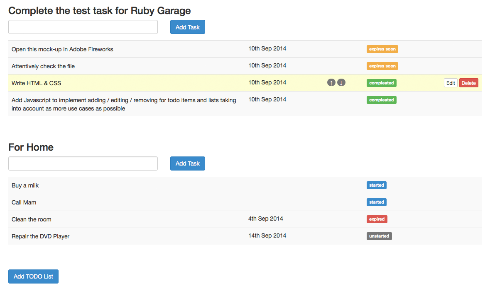

# TODO List

## SQL task 

## Given tables:

1.   tasks (id, name, status, project_id)
2.   projects (id, name)

## Write the queries for:

### 1. get all statuses, not repeating, alphabetically ordered

    SELECT status FROM tasks GROUP BY status ORDER BY status;

### 2. get the count of all tasks in each project, order by tasks count descending

    SELECT project_id, COUNT(id)
    FROM tasks
    GROUP BY project_id
    ORDER BY COUNT(id) DESC;

### 3. get the count of all tasks in each project, order by projects names

    SELECT projects.id, projects.name, COUNT(tasks.id)
    FROM tasks
    INNER JOIN projects ON projects.id = tasks.project_id
    GROUP BY projects.id, projects.name
    ORDER BY projects.name;

### 4. get the tasks for all projects having the name beginning with “N” letter

    SELECT * FROM tasks WHERE name LIKE 'N%';

### 5. get the list of all projects containing the ‘a’ letter in the middle of the name, and show the tasks count near each project. Mention that there can exist projects without tasks and tasks with project_id=NULL

    SELECT projects.id, projects.name, COUNT(tasks.id)
    FROM projects
    LEFT JOIN tasks ON tasks.project_id = projects.id
    WHERE projects.name LIKE '_%a%_'
    GROUP BY projects.id, projects.name;

### 6. get the list of tasks with duplicate names. Order alphabetically

    SELECT name
    FROM tasks
    GROUP BY name
    HAVING COUNT(name) > 1
    ORDER BY name;

### 7. get the list of tasks having several exact matches of both name and status, from the project ‘Garage’. Order by matches count

    SELECT tasks.name
    FROM tasks
    LEFT JOIN projects ON projects.id = tasks.project_id
    WHERE projects.name = 'Garage'
    GROUP BY tasks.name, tasks.status
    HAVING COUNT(tasks.id) > 1
    ORDER BY COUNT(tasks.id);

### 8. get the list of project names having more than 10 tasks in status ‘completed’. Order by project_id

    SELECT projects.id, projects.name
    FROM projects
    INNER JOIN tasks ON tasks.project_id = projects.id
    WHERE tasks.status = 'completed'
    GROUP BY projects.name
    HAVING COUNT(tasks.id) > 10
    ORDER BY projects.id;
